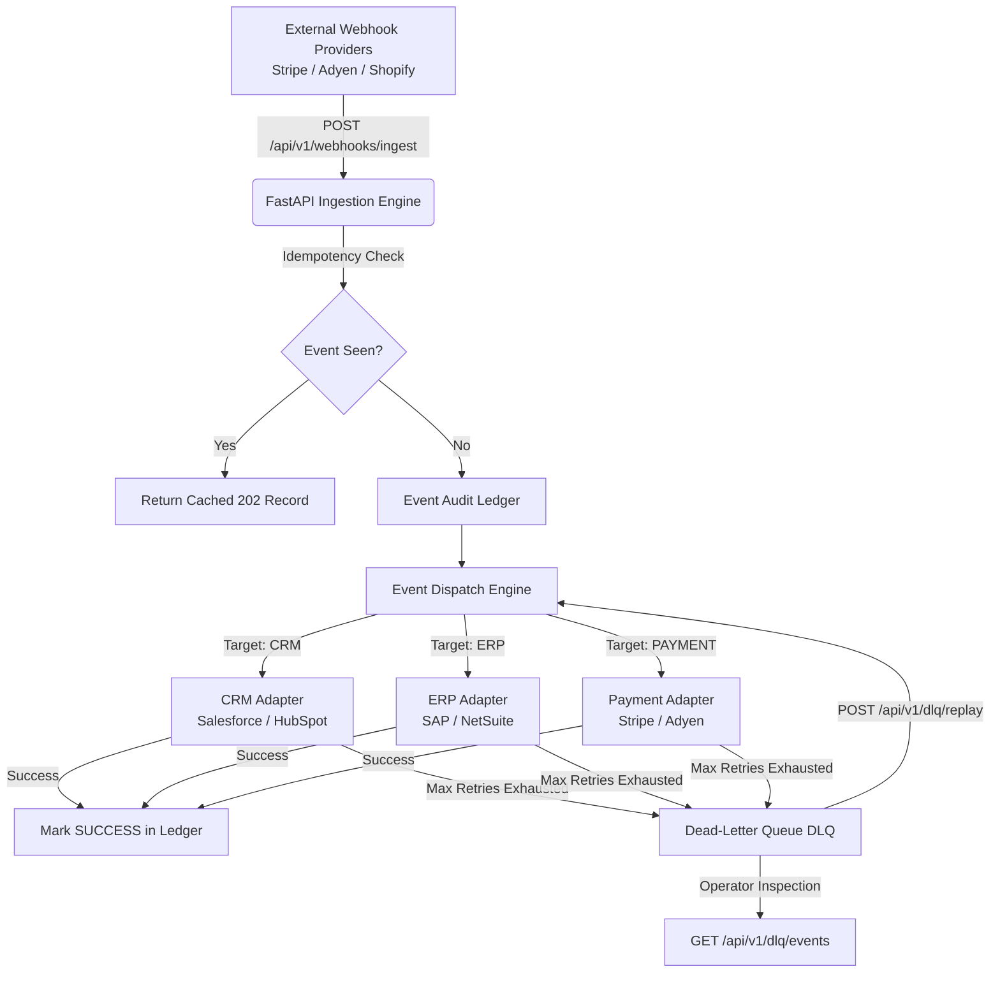

# Enterprise Integration Hub (`enterprise-integration-hub`)
**Author:** Mahdi Fattahi (`Borino88`) — Senior Full-Stack & Backend Engineer  
**Live Studio & Systems Atlas:** [https://fattahi.xyz](https://fattahi.xyz)

---

## 🚀 Overview
**`enterprise-integration-hub`** is a production-grade integration broker and webhook ingestion engine built to decouple high-throughput external events from critical internal enterprise subsystems (CRM, ERP, Payment Gateways).

Engineered with **Python 3.13, FastAPI, and Pydantic v2**, the platform demonstrates defense-in-depth messaging architecture:
- **Idempotent Webhook Ingestion:** Eliminates duplicate transactional processing using SHA-256 / UUID idempotency keys.
- **Exponential Backoff Retry Engine:** Automatically mitigates transient network drops and 5xx gateway timeouts across CRM (Salesforce/HubSpot) and ERP (SAP/NetSuite) adapters.
- **Isolated Dead-Letter Queue (DLQ):** Captures exhausted retries, preserving malformed or rejected payloads for operator inspection and 1-click event replay.
- **Real-Time Audit Ledger:** Immutable in-memory state tracking for complete end-to-end event observability.

---

## 🏗️ Architectural Topology



---

## ⚡ Core Engineering Capabilities

### 1. Idempotency Enforcement
In distributed systems, webhooks are frequently retried by senders during network latency spikes. The ingestion API checks `event_id` against the transaction journal; duplicates immediately receive the cached response without executing duplicate billing or CRM record generation.

### 2. Exponential Backoff with Jitter
When an external gateway drops connection, the `ExponentialBackoffEngine` computes non-linear retry intervals (`delay = base_delay * (1.5 ^ attempt)`), protecting downstream systems from thundering herd DDoS conditions.

### 3. Dead-Letter Queue (DLQ) & Event Replay
When retries exceed threshold (`max_retries = 3`), events are routed to the DLQ with full stack trace capture. Operators can inspect failed payloads and trigger `/api/v1/dlq/replay/{dlq_id}` once downstream outages resolve.

---

## 💻 Local Development & Quickstart

### Prerequisites
- Python 3.11+ or Docker & Docker Compose

### 1. Clone & Setup Virtual Environment
```bash
git clone https://github.com/Borino88/enterprise-integration-hub.git
cd enterprise-integration-hub
python -m venv venv
# On Windows:
venv\Scripts\activate
# On macOS/Linux:
source venv/bin/activate

pip install -r requirements.txt
```

### 2. Run Automated Test Suite
The repository includes a 100% passing automated test suite verifying idempotency, DLQ routing, and replay recovery:
```bash
pytest --cov=src tests/
```

### 3. Start Development Server
```bash
uvicorn src.api.main:app --host 0.0.0.0 --port 8000 --reload
```
Interactive OpenAPI Documentation will be available at: [http://localhost:8000/docs](http://localhost:8000/docs)

---

## 🐳 Docker Deployment
Run the complete containerized stack using Docker Compose:
```bash
docker-compose up --build -d
```
Verify container health:
```bash
curl http://localhost:8000/health
```

---

## 🛡️ License & Authorship
This project is an **original open-source architectural demonstration** authored by Mahdi Fattahi (`Borino88`).  
Licensed under the [MIT License](LICENSE).
